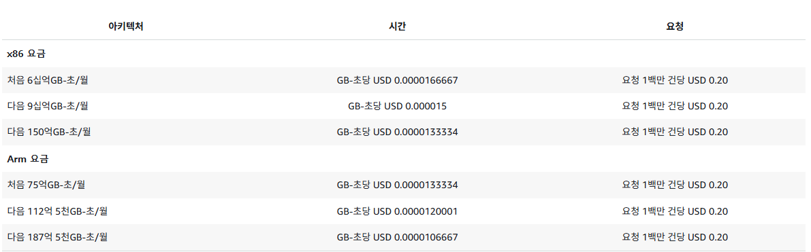

# DPP(Digital Product Passport, 디지털 제품 여권)

규제 배경
EU 핵심 원자재 수입 의존도 심화

EU 핵심원자재법(CRMA, EUBR, ESPR...)


----

# 0430

## 제안서 Form
**어필점**  
ESG 시스템 도입이 필요한 이유 설명 (내부 관리/외부 대응으로 info): 공시규제, 업무효율화, ESG평가 요구 증가  
ESG 공시 고도화 
- 하나의 공시에만 대응하는 것이 아니라 여러 공시를 대응할 수 있게 만들어준다.  
- 연결 Data 관리용 시스템이 필요하다.
- 연결기준 공시지표가 다변화: 공시규제, 평가대응이 가능한 통합인덱스 보완, 그룹사 지표 표준화 필요
그룹사 Data 보고 체계
내부 관리
- 계역사간 ESG 지표 불일치(그룹내 Datat Coverage 차이 -> 조정비용 발생)
- 우리가 가진 기술이 제안대상에게 적용포인트를 어필하는게 중요(기술 자랑이 아님.)
- 실적역시 제안대상과 제안 기술에 맞는 실적만 뽑아 어필

### 서비스 방향성
- 그룹 & 계열사간 지표, 데이터 표준화 (공시기준 4가지 기준, 평가(S&P, MSCI) 지표인덱스 표준화 통하여 데이터 표준화)
- 여러 공시에 대응하도록
- 책임자 일괄 승인이 부담이 되는가? 현재는 일괄 승인제인데
- 데이터 이상치 검증 AI로 자동화(과거 데이터 학습으로 금년 이상치 도출)=>정상값 예측 필요
- 보고서 초안작성 -> only텍스트 위주를 표형식으로 도식화하여 가독성 높일 필요 有
- 데이터 입력, 검초, 확전 전 변경이력 관리. 증빙자료 관리
- KPI, 목표관리(진행도)


---

# 0504

## 권한
Data 검토/승인 과정: 자회사 -> 계열사 -> 지주(전체: 현업직원, ESG팀, 최종 승인권자)  
권한 설계: 조직별 권한정의, 사용자별 권한 맵핑 -> 메뉴-권한 매핑, 기능 권한 정의 -> 사용자-기능 맵핑

## DATA 구조
실제 데이터를 기준정보 및 실적 기준으로 취합 -> 전사 표준 메타데이터 변환  
지주의 MDG(기준정보)를 기준으로 계열사의 ESG 기준정보를 맵핑함  
기존에 관리하지 않던 데이터는요?  
ESG 기준으로 새롭게 추가하여 맵핑  

각자 관리하는 데이터 -> 그룹 표준코드 변환(리팩토링) -> 유효성 검증 -> MDG별 계열사 원천 데이터 관리  
관리코드 | 그룹명 | 코드 | 코드명 | 코드 한글명 | 추가속성1 | 추가속성2 | 추가속성3 | 추가속성4 | 추가속성5 |
| :--- | :--- | :--- | :--- | :--- | :--- | :--- | :--- | :--- | :--- |
UT001 | Utility | E | Electrictiy | 전력 | KWH | Energy | Rate | E | 1
UT001 | Utility | LNG | LNG | LNG | NM3 | Energy | Flag | E | 1

### case정의 및 케이스별 취합 방식 프로세스 설계  
내부 데이터: 시스템 외 관리?, 활용가능?(규제에 맞는 데이터인가)
외부 데이터: API 연동 가능?(미디어 클로링, 올바로/물바로 배출계수 DB 등)    
yes -> 자동 InterFace  
no -> 수기 입력(Excel로 받는게 편함)  
보통 데이터는 3개월정도 후에 사용 가능함  
정량인지 정성인지 구분하여 취합
| 구분 | 정량 (Quantitative) | 정성 (Qualitative) |
| :--- | :--- | :--- |
| **핵심 기준** | 양(Amount), 수치 | 질(Quality), 특징 |
| **데이터 형태** | 숫자, 통계, 등급 | 글, 의견, 경험, 맥락 |
| **평가 방식** | 객관적, 자동화, 구조화 | 주관적, 종합적, 해석적 |
| **질문 예시** | 얼마나? (How many/much?) | 왜? (Why?) |
| **예시** | 내신 등급, 매출액, 점수 | 생활기록부 행동특성, 면접 |

원천 -> 집계 => 통합 data로 관리  
ex) 사업장A 전력사용량/경유사용량, 사업장B 전력사용량/경유사용량(원천) -> CJ제일제당 전력사용량, CJ대한통운 경유사용량 -> 탄소배출량(집계) => 온실가스 배출량  
사업장 -> 종속회사 -> 본사 와 같은 데이터 계층 구조 정의필요  

### 보고서 자동화 
Index Library 설계 -> 3개년치 중대이슈 공시기준 index 맵핑  
AI 프롬포트 설게 -> 지표별 요구사항에 맞게 프롬포트 및 응답설계  
응답 결과 정량평가(정확도/ 예측 불확실성 분석)  
입력된 데이터 시각화 기능 지원(표, 그래프) -> HTML <table> 태그 및 CSS(TWail어쩌구 그거 씀)  
사용자 메뉴얼 필요한가? 논의해보자 SKM  
기대효과: 표준개발시스템을 통해 개발 생산성 및 비용 절감 가능  
KPI DashBoard  
데이터 수집 표시(출처별 데이터 수집 가공 품질상태 표시)  
가장 중요한 지표를 상단에 표시  
[입력] 시스템 Source + 수기 Source -> [검증] Staging(임시저장) -> 유효성 검증 (검증실패시 원천 재요청) -> 이상치 탐지/검증 -> [확정] DB저장

이상치 탐지: 
- 시계열기반: 전년 동월, 직전분기 등의 급등락 탐지 +-N%지정값 초과시 Alert처리
- 물리적 임계치: 계열사/자회사/사업장/설비 Data 최소~최대 임계치 기반 검증. 법정기준 상한선을 초과하지 않는지
- 다차원 상관관계: 예) 생산량 10% 감소했는데 에너지 사용량 50% 증가 -> 엥? 말이 안돼. 오기입 혹은 측정오류로 판단하여 식별해냄

+) 수기입력 데이터 관리: AI OCR기반 검증 -> 입력값 유효 조건 체크 후 입력 완료 처리, 엑셀 업로드 템플릿 로직 내재화 or 엑셀 템플릿 구조화

### AI OCR 검증
- 이미지 전처리: 노이즈 제거, 기울임 보정, 텍스티 인식이 필요한 특정 영역 보정(테이블이나 금액 필드), 해상도 최적화 등
- 문서 분류: 사전 정의된 Data 항목, 필수 증빙자료 유형 자동분류(정형/반정형/비정형)  
            - 정형: 레이아웃이 표준화되어있음(고지서, 명세서 등)    
            - 반정형: 키워드 패턴, 정규 표현식, NLP 모델 복합 활용(영수증 같은)  
            - 비정형: NLP기반 처리, 고유 의미를 가진 단어나 수치 파악, 의미적 관계 분석  
            - **정형데이터 분류가 가장 우선순위**
- 텍스트 검출: 이미지 내 텍스트 영역 사전지정된 바운딩박스로 검출(ex> x1:100, y1:50, x2:500, y2:80)
- 문사 인식 및 추출: 바운딩 박스 영역 내 픽셀 정보 문자열 data로 변환(자음, 모음, 숫자 등 개별문자로 분류 + 문자열로 조합)
- 핵심 data 추출 로직 및 후처리 로직 적용(오타교정, 표준 포멧으로 변환: 숫자와 단위 분류 등)
- 정합성 검증(수기 산출값이랑 ocr 데이터값이 일치하는지)

### Data 버전관리
수정 및 삭제시 History관리가 필수.   
변경 원인, 변경자, 날짜 등 필수 기록되어야함 -> **이걸 history db로 따로 관리해야하는가?**
1. data point 단위 관리 구조(어떤 세부지표, sub topic, topic, issue에 묶였는지 순차적 관리 필요)
2. 공시 기준별 표준 목차 내재화
3. 연결기준 초안 생성 및 자동 윤문기능 구현 필요
4. 보고서 내용배치, 목차, 표, 이미지 등 수정 가능하도록 관리


**이상치 탐지 Q1> 시계열 기반 급등락 감지 퍼센테이지를 어떻게 기준을 잡아야하는지. data마다 다른 기준점을 잡는건지 통일 계산치가 있는지.**
**이상치 탐지 Q2> 이상치 검증을 AI가 판단하도록 하는게 맞다? 아니면 특정 시나리오마다 계산식을 세워 측정하는게 맞다?**

룰베이스로 처리할 과정과 AI에게 맞길 과정 분배 필수.


### Data Mapping 사전
AI 자체 판단으로 사전 제작하도록: 인간이 생각치못한 경우의 수 가지를 뻗을 수 있게 사전 다양화 필요하지 않을까  
외국어 등은 AI 판단이 더 쉬움  
1차 사전은 휴먼 -> 2차 디벨롭(오류 시나리오 다양화)

**데이터 유효성 관리 위해서 온톨로지 기반으로 생성한 회사별 지식 그래프 사용**  
-> 각 회사별로 맞춤화 하여 사용할 수 있다는 장점이 있음


---

# 문서 작업
- wbs
- 데이터 정의서 + 데이터 workflow 구성 필요
- 시나리오 작성(업무 흐름)
- 해당 프로젝트를 왜???? 구성했는지, 무엇을 위함인지가 가장 중요한 포인트(최상단에 나와야함) README, PPT 상단에 기록
- 요구사항 명세서? 필요할까 
- API 명세서 필수
- 회의록은 only dicussion log에만 작성할 예정

## 페르소나 수정안
- 지주사 / 자회사로 설정 타겟 변경
기업 페르소나 상세내역 추가
- 페르소나를 아래 기준으로 작성
- 기업 자산규모, 매출규모, 사업장 보우 여부(위치, 국내외 등), 임직원 수, 현재 대응중인 공시기준, 유럽 수출여부/시점, 대표기종 등등

상세 내역으로 인해 ~한 공시 필요함 이런 식의 내용 필요


---

# AWS Lambda

비동기식 이벤트(S3, SNS, EventBridge, StepFunctions, Cloudwatch Logs의 이벤트 포함): 처음 256KB 동안은 각 비동기식 이벤트당 요청 1개에 대해 요금이 부과됩니다. 256KB를 초과하는 개별 이벤트 크기에는 최대 1MB까지 64KB 청크당 추가 요청 1개로 요금이 부과됩니다.

# Prisma

# Next.js

## next.js 성능 비교
- I/O Bound에는 그다시 차이 없음. 비동기처리 둘다 잘 됨
- CPU Bound 성능이 좀 떨어짐
- 싱글스레드라서 무거운 계산 어려움
- 라이브러리 연동 어려움

- 장점: 백엔드 API 연결 간단함  
*근데 FastAPI가 AI 연결하기에는 좋음*
- 단점: API 요청때만 켜졌다 꺼지는 방식이라서 State 관리가 어렵다고 봄 => 우리는 각 Agent끼리 결과값 기억 후 전달이 필수
*실제 서비스에서는 두가지 혼합하는 멀티로 사용하는 경우 많음*

- CSR: (Client-Side Rendering): 빈 html에 jsx받아 그리는 방식(지금 우리가 쓰고있는거)  
장점은 한번 로딩이 오래걸릴뿐 페이지 이동이 부드러움

- SSR: (Server-Side Rendering): 사용자가 요청할 때마다 서버에서 실시간으로 HTML과 JSON데이터를 렌더링하여 완성된 페이지를 보냄  
=> 언제접속하든 최신 데이터가 반영된 페이지를 볼 수 있음(우리 서비스에 유리함)  
단점은 서버 부하 걸릴 수 있음 요청시마다 연산돌리니까

- SSG: (Static Site Generation): 서비스를 빌드(배포)하는 시점에 미리 HTML 페이지들을 다 만들어 두고, 사용자가 요청하면 저장된 파일을 그대로 보여줌  
캐시서버CDN에 저장해두고 이미 만들어진 HTML 반환  
단 실시간 데이터가 필요한 곳엔 별로임(우리 서비스에 비추)

### 결론
- Next.js: ui, 실시간 KPI, 사용자인증, SSR
- FastAPI: AI 모델제어
실시간으로 불러야하는 KPI같은거랑 사용자 화면에 바로바로 보이는 결과단은 next.js를 쓰고
AI 로직은 FastAPI를 쓰는 방식

데이터 업로드하자마자 화면에 보여야하는 페이지(ex> 온보딩) SSR

# 0520

## OCR TEST

모델

```
"[\n  {\n    \"issue\": \"기후변화 대응\",\n    \"sub_issue\": \"제조공정과 공급망, 제품 포트폴리오, 제품의 사용 등 가치사슬 전반에 연관되어 사업 모델과 재무성과에 영향을 미치며, 친환경 차량 요구 증가에 따른 전동화 부품 매출 증가 및 글로벌 규제 대응을 통한 재무적 기회 전환이 필요함.\"\n  },\n  {\n    \"issue\": \"자원 사용 및 순환 경제\",\n    \"sub_issue\": \"자원 재활용 등의 공정 전환, 부품 소재 경량화를 통한 온실가스 감축, 친환경 제품 생산을 통한 환경영향 저감 및 소비자에게 가치 소비 기회 제공.\"\n  },\n  {\n    \"issue\": \"인적자원 관리\",\n    \"sub_issue\": \"모빌리티 기술 변화에 따른 전문 인력 육성, 우수 인재 확보를 통한 제품 혁신 및 재무적 손실 방지, 공정한 채용을 통한 사회 활동 기회 제공 및 노동환경 개선 유도.\"\n  },\n  {\n    \"issue\": \"산업 안전보건 강화\",\n    \"sub_issue\": \"임직원의 안전하고 건강한 근무 환경을 조성하고 산업 재해 예방을 위한 안전보건 관리 체계를 강화함.\"\n  },\n  {\n    \"issue\": \"공급망 지속가능성 관리\",\n    \"sub_issue\": \"원자재 채굴 및 가공 과정의 환경 파괴, 노동권 침해 예방, 협력사 리스크 관리를 통한 부품 조달 안정성 확보 및 공급망 규제 준수.\"\n  },\n  {\n    \"issue\": \"제품 품질 및 안전 확보\",\n    \"sub_issue\": \"제품의 품질 향상 및 안전성 확보를 통해 고객 신뢰를 구축하고 제품 결함으로 인한 재무적 리스크를 최소화함.\"\n  },\n  {\n    \"issue\": \"신뢰받는 노사관계\",\n    \"sub_issue\": \"노사 간의 신뢰를 바탕으로 협력적 관계를 구축하고 안정적인 근로 환경을 조성함.\"\n  },\n  {\n    \"issue\": \"다양성 및 포용성\",\n    \"sub_issue\": \"조직 내 다양성을 존중하고 포용적인 문화를 조성하여 임직원의 역량을 극대화하고 조직 경쟁력을 강화함.\"\n  },\n  {\n    \"issue\": \"정보보안 강화\",\n    \"sub_issue\": \"기업의 정보 자산 및 고객 데이터를 안전하게 보호하고 사이버 보안 리스크를 선제적으로 관리함.\"\n  },\n  {\n    \"issue\": \"기업지배구조\",\n    \"sub_issue\": \"투명하고 건전한 지배구조 확립을 통해 기업 경영의 투명성을 높이고 주주 및 이해관계자의 권익을 보호함.\"\n  },\n  {\n    \"issue\": \"컴플라이언스 경영\",\n    \"sub_issue\": \"법규 준수 및 윤리 경영 체계를 강화하여 비즈니스 운영의 투명성과 신뢰성을 제고함.\"\n  }\n]"
```

- 소요 시간: 5.45초
- 메모리 변화량: 17.73 MB (최종: 125.52 MB)

### 문제
1일 20회만 무료임.
